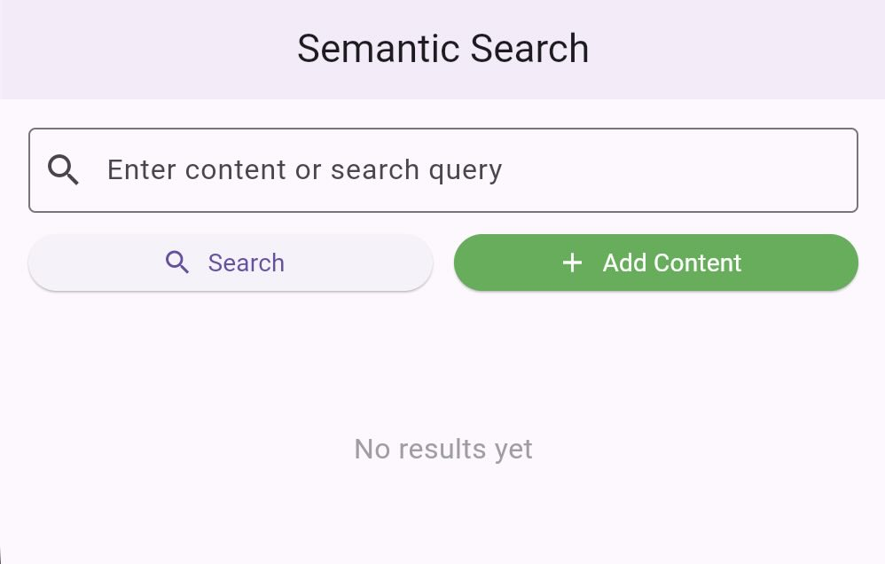

# 🧠 Semantic Search Web App

## 🌍 Overview
This project is a **Semantic Search Web App** built with **Flutter and Dart**.  
It allows users to **add text content** and then **search by meaning**, not just exact words.

For example:
- If you add “I like studying science,”  
- And later search for “learning subjects,”  
The app can still find that sentence because both have similar meanings.

---

## 💡 What Is Semantic Search?
**Semantic Search** means searching by **meaning**, not by exact words.  
It uses **AI embeddings** — small numeric vectors that represent the meaning of words or sentences.

### 🧩 How It Works
1. Every text or query is converted into an **embedding** (a list of numbers).  
2. These embeddings are compared using **cosine similarity**.  
3. A **threshold** value (like 0.8) is used — if similarity ≥ threshold, the result is considered a match.

### 📊 Example
| Sentence | Meaning Vector (shortened) |
|-----------|----------------------------|
| "I enjoy reading books" | [0.21, 0.55, 0.91, ...] |
| "Learning new things is fun" | [0.20, 0.56, 0.89, ...] |

→ The vectors are very close, so the system says: “They are semantically similar!”

---

## ⚙️ Features
- 🔍 **Search by meaning**, not by keywords  
- ➕ **Add new content dynamically**  
- 💾 **Supabase** used for data storage  
- 🌐 Works perfectly in **Flutter Web**  
- 🧠 **Embeddings-based search** (AI-powered)  
